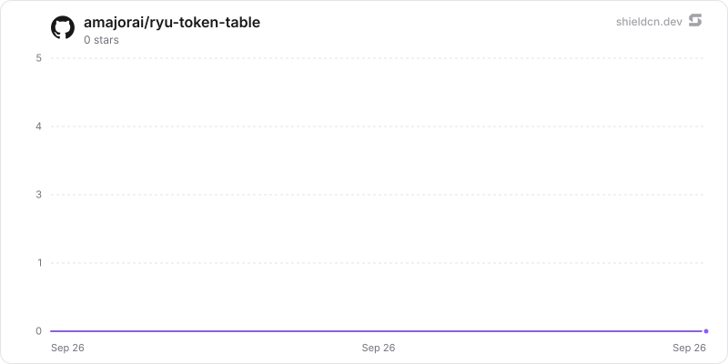

<p align="center">
  <picture>
    <source media="(prefers-color-scheme: dark)" srcset="./icon-dark.png" />
    
  </picture>
</p>

<div align="center">

# Token Table

</div>

A persisted simulated-token poker table with a Companion, realtime updates, and a Rust sidecar.

> **The public home of `ryu-token-table`.** Source, builds, and releases live here —
> binaries for every platform are attached to each release.
>
> This tree is generated from the Ryu monorepo, so commits pushed here
> directly are replaced on the next sync. **Pull requests are welcome** —
> open them here and they are ported into the monorepo, then flow back out.
> Ryu as a whole: https://github.com/amajorai/ryu

## Install

**App:** [Install](ryu://apps/@ryu/token-table) (opens the Ryu desktop app and asks you to confirm)

**CLI:**

```bash
ryu apps add @ryu/token-table
```

**Crate:**

```bash
cargo install ryu-token-table
```

Prebuilt binaries for every platform are attached to [each release](https://github.com/amajorai/ryu/releases).

## License

Apache-2.0 — see [LICENSE](./LICENSE).

## Layout and seam

- `backend/` is the standalone `ryu-token-table` Rust sidecar and the sole owner of
  `token-table.db` under `${RYU_DIR}`.
- `manifest.json` declares the local process on the reserved 8019 sidecar port,
  the generic ext-proxy mount `/api/token-table`, and `RYU_TOKEN_TABLE_PORT`.
- `plugin.json` is the install/catalog descriptor. There is intentionally no UI in
  this backend package; the companion bundle is declared by the manifest at
  `./dist/index.html` and feature-detects the app before using the generic bridges.

The platform worker only needs to register the satellite manifest, mount the
companion bundle, spawn
`ryu-token-table`, inject `RYU_DIR`, `RYU_TOKEN_TABLE_PORT`, and `RYU_EXT_TOKEN`, and
proxy the declared public mount. No app-specific Core route or client is required.
The binary binds loopback-only, leaves `/health` unauthenticated for the sidecar
probe, and fail-closes all mounted routes without the injected bearer.

## HTTP contract

All paths below are relative to `/api/token-table`:

- `POST /tables` creates a table. Defaults are six seats, blinds 5/10, and a 1,000
  simulated-token starting stack.
- `GET /tables` and `GET /tables/:table_id` return full authoritative snapshots.
- `POST /tables/:table_id/join` adds a player; `POST /seat` assigns a seat from 0
  through 5; `POST /leave` removes a player between hands.
- `POST /start` begins a hand explicitly. Seating a second player also starts the
  first waiting hand for a responsive UI.
- `POST /action` accepts `fold`, `check`, `call`, `bet`, `raise`, or `all_in`.
  `bet`/`raise` amounts are total chips committed on the current street, not a
  delta. Every action includes a client-generated `action_id` and the snapshot's
  `expected_action_seq`; duplicate IDs replay the original result, while a wrong
  sequence is rejected as stale before any mutation.
- `GET /tables/:table_id/events` is a generic SSE stream. The publisher emits
  `token_table.snapshot` events after committed mutations; the same publisher is a
  trait seam for a host worker that wants to forward realtime updates elsewhere.

The companion manifest requests the standard `app:http` and `app:realtime` grants.
The trusted host owns the table id, bearer token, room connection, and presence
identity; the frame receives neither credentials nor a sidecar URL. Its request
adapter maps snapshot/join/leave/new-hand/action commands to the routes above, and
its realtime adapter uses a room id derived from the table id. The sidecar remains
the sole authority for poker state; the application-room stream is fan-out only.

The authoritative engine owns blinds, turn order, no-limit betting invariants,
fold/call/check/raise/all-in validation, deterministic server-side decks, board
progression, seven-card showdown ranking, split pots, and chip conservation. The
deck seed is generated server-side and persisted with the table state; clients
cannot provide or replace a deck.

## Verification

```sh
cargo test --manifest-path apps-store/token-table/backend/Cargo.toml
cargo check --manifest-path apps-store/token-table/backend/Cargo.toml
```

The unit suite covers ranking, betting/token conservation, blind and board
progression, stale/idempotent actions, and snapshot serialization.

## Star History

<a href="https://github.com/amajorai/ryu-token-table/stargazers">
  <picture>
    <source media="(prefers-color-scheme: dark)" srcset="./.github/shieldcn/star-chart-dark.svg" />
    
  </picture>
</a>
